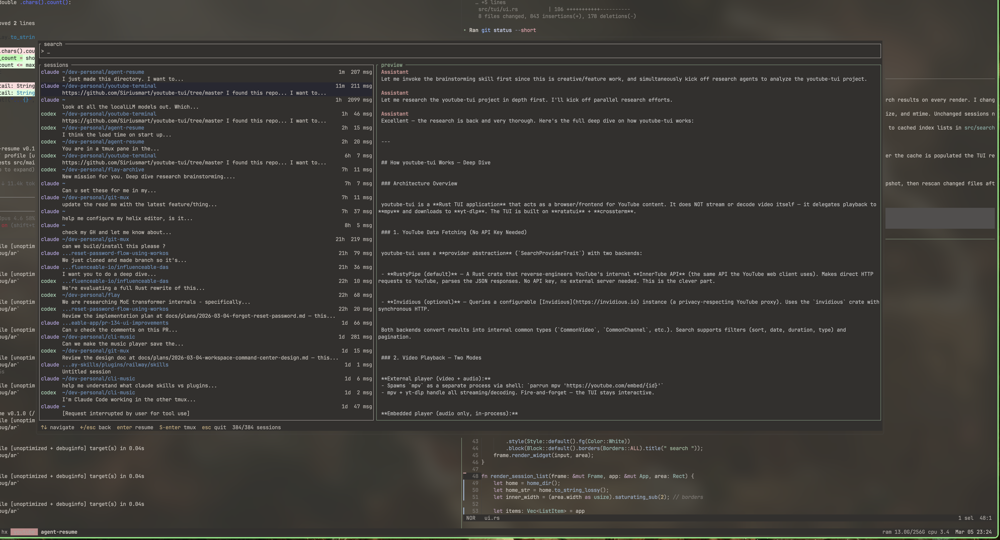

# resume-mux

A TUI for searching and resuming Claude Code and Codex coding agent sessions.

## Install

```
cargo install --path .
```

## Usage

```
ar              # launch TUI
ar "search"     # pre-fill search query
ar -a claude    # filter by agent
```

## Keybindings

| Key | Action |
|-----|--------|
| Type | Fuzzy search sessions |
| `↑`/`↓` | Navigate session list |
| `→`/`Tab` | Focus preview pane |
| `←`/`Esc` | Back to sessions |
| `Enter` | Resume session in current shell |
| `Shift+Enter` | Resume in new tmux window |
| `q` | Quit |
